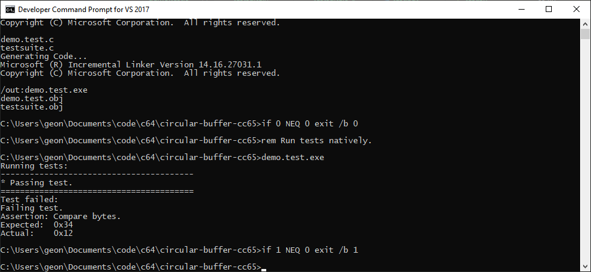
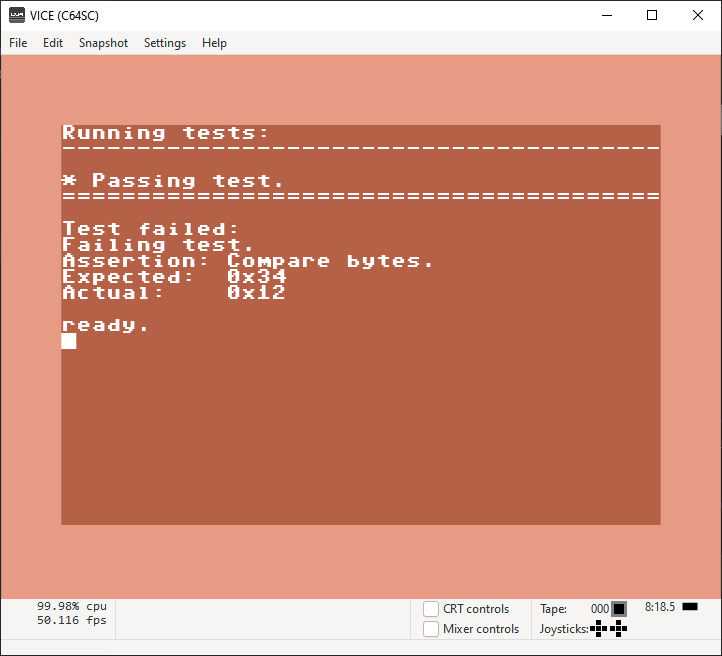
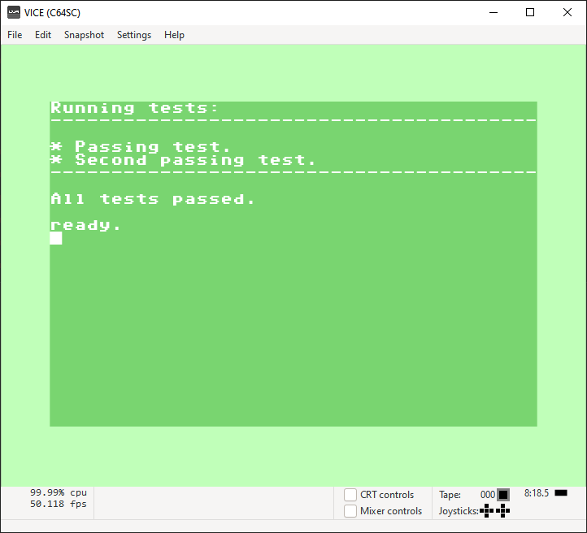

cc65-test
=======

Super simple test framework for cc65. Should also work in any C compiler.

You might be better off using [c64unit](https://www.commocore.com/repository/c64unit) or [64spec](https://64bites.com/64spec/) .

The included `test.bat` script is set up to run the tests natively first, and only run the emulator if they pass.

Failing test in the console
--------------------

Failing test in the emulator
--------------------

Passing test in the emulator
--------------------

